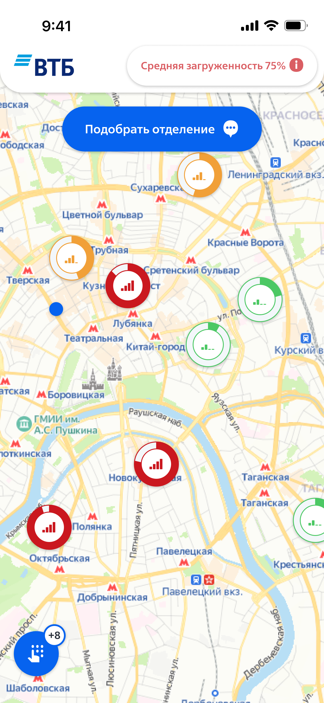
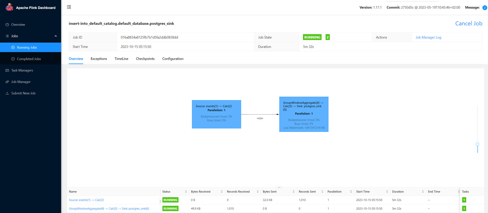
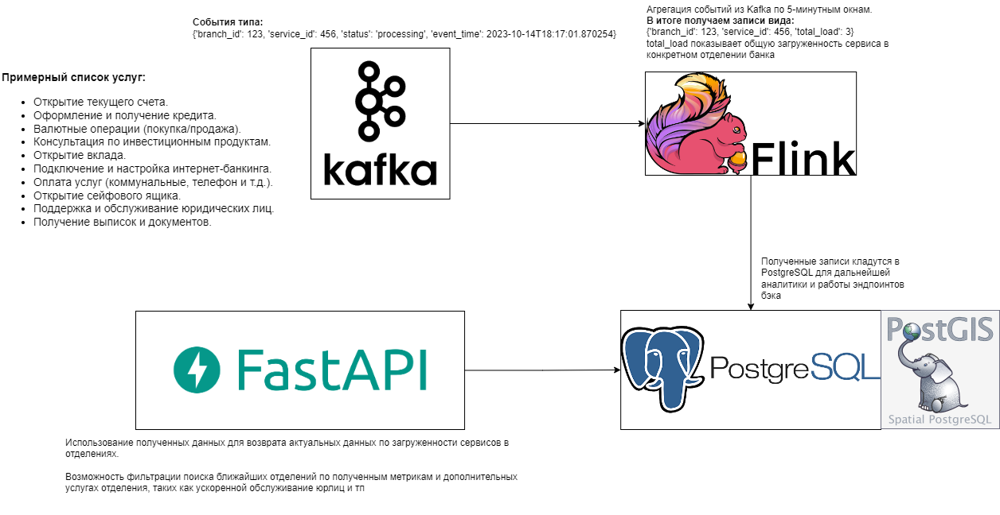
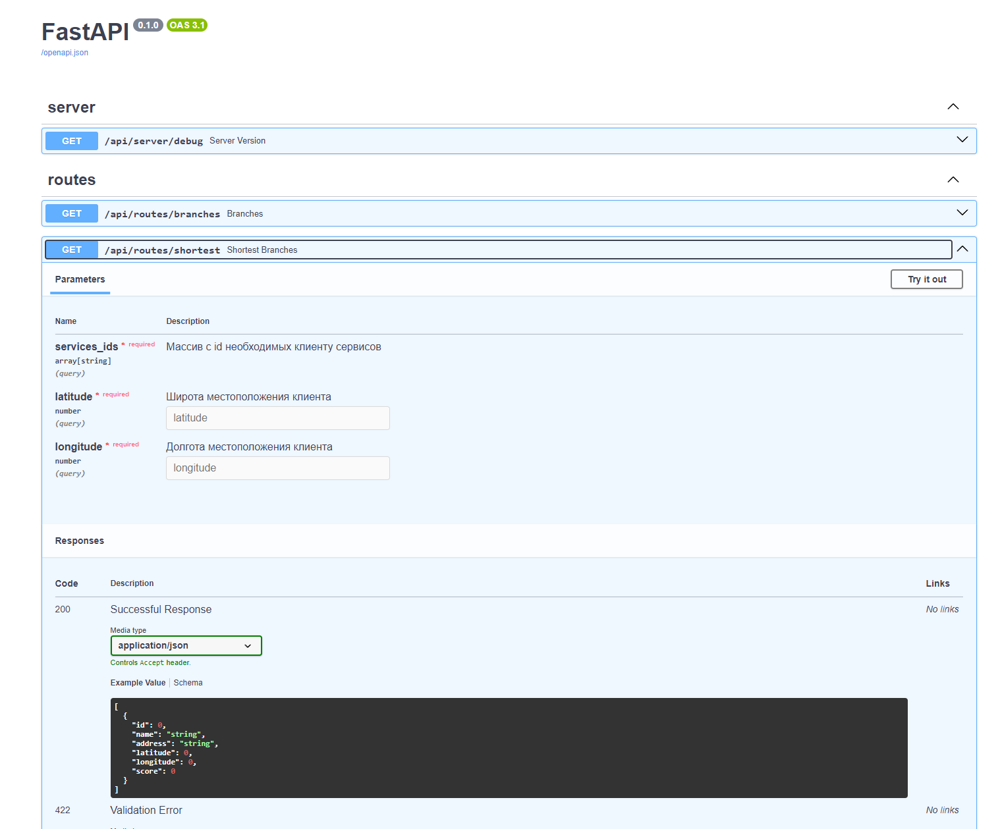

## Хакатон MORE.Tech 5.0 ВТБ

Трек 1 - MOBILE + WEB - Сервис подбора оптимального отделения банка, учитывая
потребности клиента и доступность услуг  



### Описание решения
Был разработан сервис backend + frontend.  
Одним из требований было определение загруженности банковского отделения.
Для того чтобы имитировать реальные данные были развернуты `Apache Kafka` и `Apache Flink`.   
Для наполнения Kafka был написан mock-consumer, который генерирует рандомные события загруженности
отделений по услугам, которые данное отделение предоставляет.  
Логи Kafka имеют следующий вид:
```
{'branch_id': 30, 'status': 'processing', 'service_id': 18, 'event_time': '2023-10-15T05:37:56.034065'}
```
#### Алгоритм определения загруженности отделения банка
Flink читает данные логи и накапливает их в "окнах" по 5 минут, затем агрегирует по `branch_id` и `service_id`, 
в результате чего получаем **метрику загруженности конкретного сервиса в конкретном отделении банка** за 5 минут.  
**Pipeline** Flink лежит в директории [`events`](https://github.com/GoshkaLP/moretech_dora2023/blob/master/events/flink_pipeline.py).
Общий вид представлен на картинке:

Полученные данные загружаются в базу данных `PostgreSQL` для дальнейшей работы с ними.

#### Общая схема работы сервиса


### Описание Backend
Backend написан с использованием фреймворка `FastAPI`, имеет следующие эндпоинты:
- `/api/routes/branches` - получения списка банковских отделений ВТБ. 
- `/api/routes/shortest` - алгоритм поиска оптимального отделения с учетом его загруженности.
- `/api/services/branch/<branch_id>` - получение списка услуг, предоставляемых банковских отделений.
- `/api/services/juridical` - получение списка услуг для юридических лиц.
- `/api/services/physical` - получение списка услуг для физических лиц.

Документация Backend формируется автоматически в Swagger:


#### Алгоритм поиск оптимального отделения
Для ускорения работы с гео-данными использовалась база данных `PostgreSQL` с плагином `Postgis`.  
Алгоритм поиска оптимального отделения верхнеуровнево можно описать следующим образом: 
Поиск банковских отделений в заданном радиусе, которые предоставляют интересующие услуги, и ранжирование их по метрике **score**, 
учитывая доступные услуги и их загрузку за последние 5 минут.  
**Рейтинг (score)** определяется на основе двух компонентов: доступности услуг, которые интересуют пользователя, и загруженности этих услуг.
Он определяетс как разница между количеством доступных услуг, интересующих пользователя, и загруженностью этих услуг. 
Больший рейтинг указывает на более предпочтительное для пользователя отделение. 

### Описание Frontend
[Дизайн проекта](https://www.figma.com/file/YppRmx7BZZmDSU3hYkWwBn/%5Bdorateam%5D-MORE.Tech-5.0?type=design&node-id=140-2&mode=design)
Frontend написан с использованием React.js.  
Данный сервис представляет собой мобильное WEB-приложение. Упор на мобильную версию сделан с учетом  
популярности использования мобильных приложений в настоящее время. Любому клиенту будет намного удобнее
пользоваться мобильным сервисом, нежели десктопным.  
Были реализованы заданные требования: 
- отображение карты города.
- отображение банковских отделений ВТБ.
- построение маршрута к оптимальному отделению.

### Авторство
dorateam, 2023
